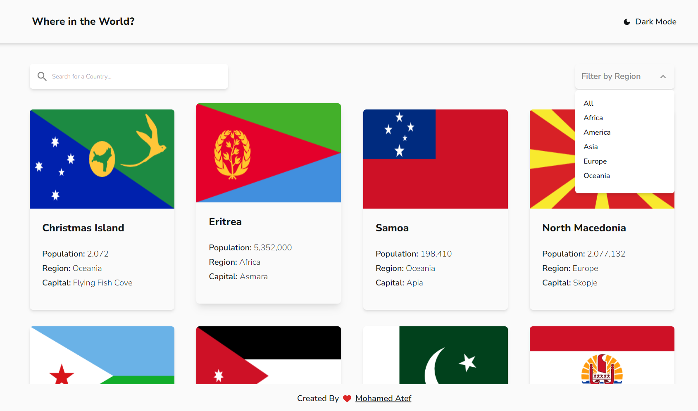
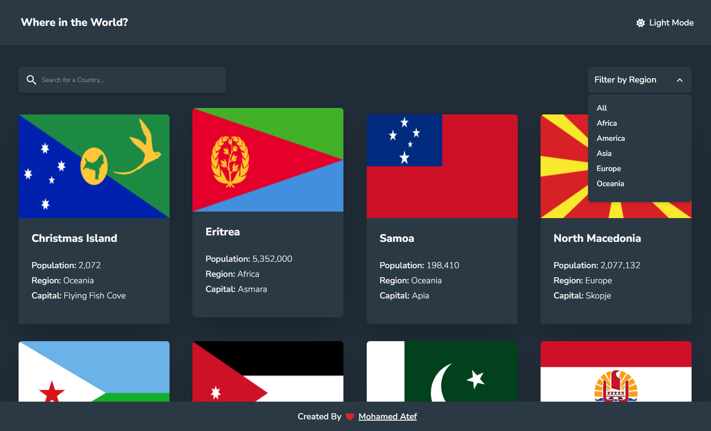
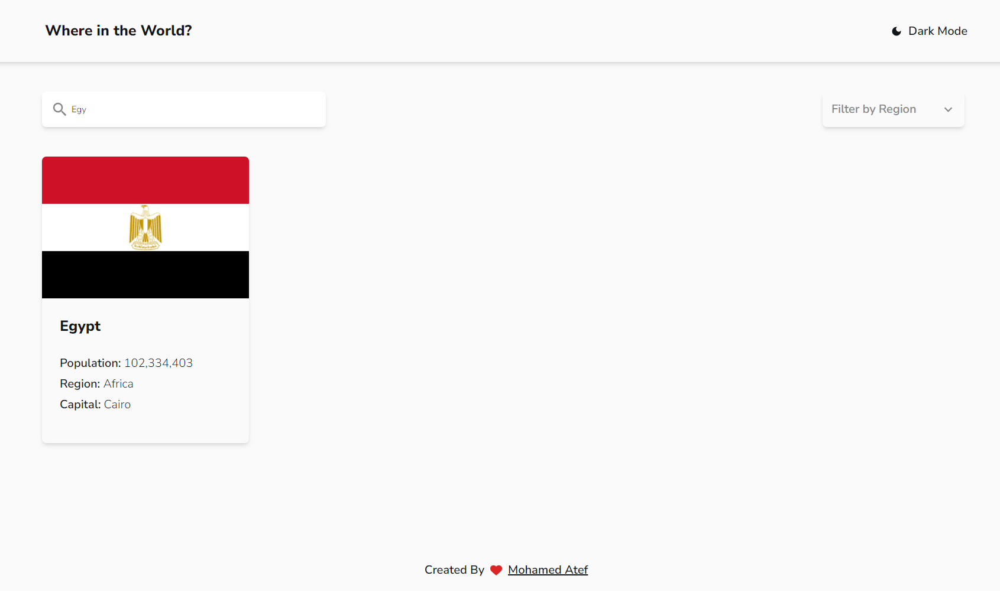
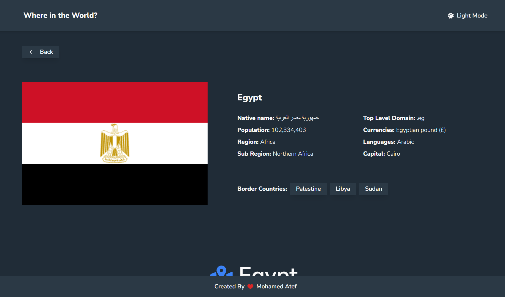
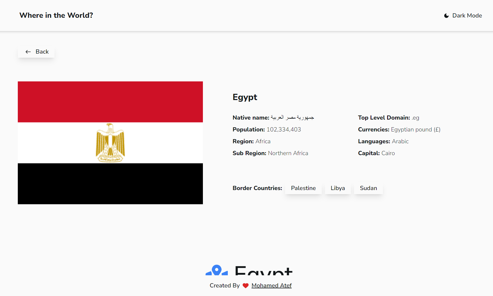
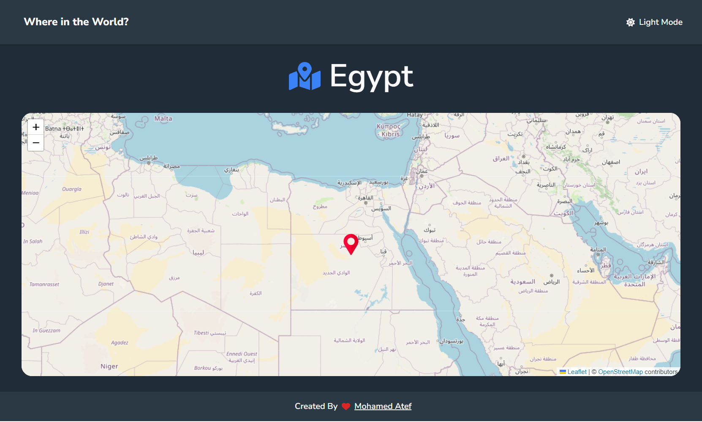
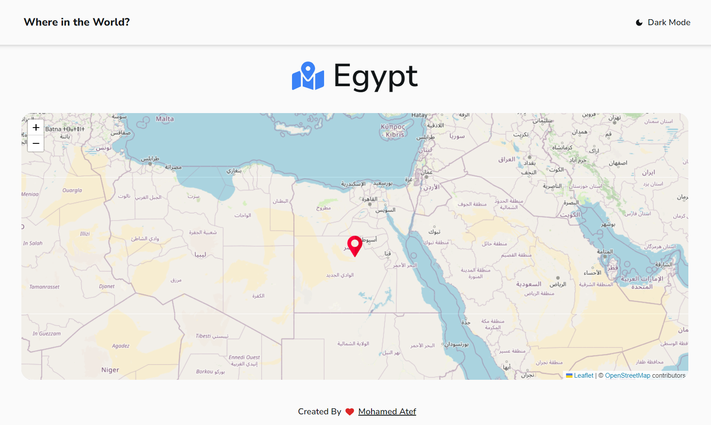
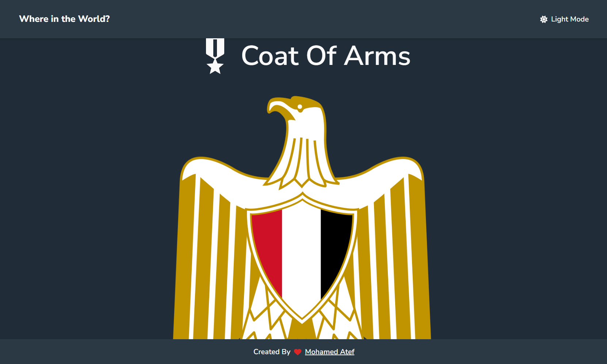
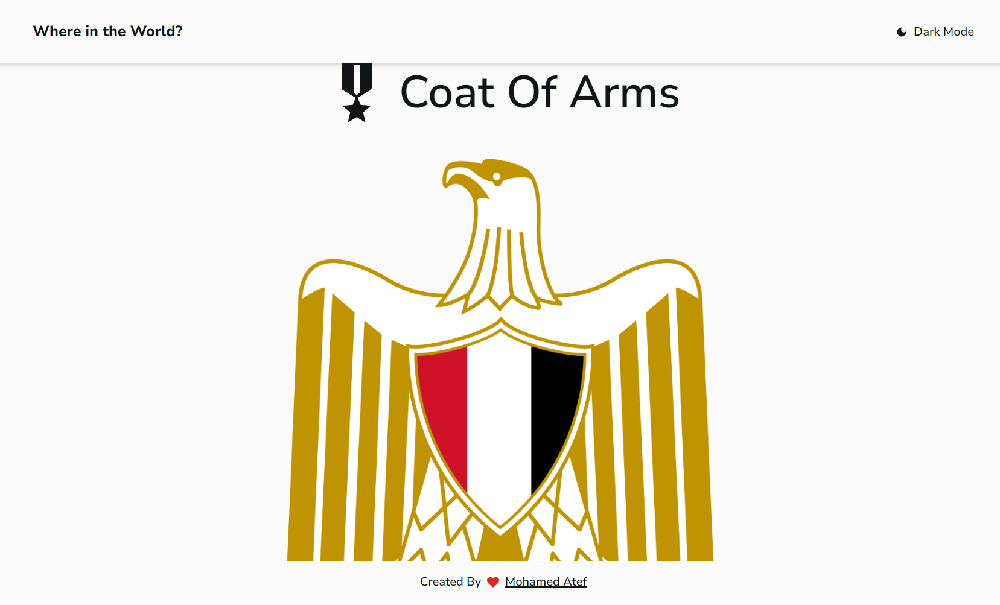

# Frontend Mentor - REST Countries API with color theme switcher solution

## Table of contents

- [Overview](#overview)
  - [The challenge](#the-challenge)
  - [Screenshot](#screenshot)
  - [Links](#links)
- [My process](#my-process)
  - [Built with](#built-with)
  - [What I learned](#what-i-learned)
  - [Continued development](#continued-development)
  - [Useful resources](#useful-resources)
- [Author](#author)
- [Acknowledgments](#acknowledgments)

## Overview

### The challenge

Users should be able to:

- See all countries from the API on the homepage
- Search for a country using an `input` field
- Filter countries by region
- Click on a country to see more detailed information on a separate page
- Click through to the border countries on the detail page
- See the country on the map
- See the coat of arms image of its country
- Toggle the color scheme between light and dark mode

### Screenshot

### Links

- Solution URL: [Click here](https://github.com/Mohamedate/map)
- Live Site URL: [live site URL](https://map-atef.vercel.app)

## My process

I utilize the Reducer and URL parameters technique to manage all state on the website. This includes scenarios such as when the user searches for a specific country, filters countries by region, or clicks on a country to view detailed information. Additionally, I implement reactQuery to handle all API requests, addressing potential errors that may occur when extracting data from the API. To enhance the user experience, I integrate the animation library Frame Motion to create visually appealing transitions for displaying countries.

I use Tailwind for styling, a fantastic library that I love for its ease of styling elements. Additionally, I have incorporated some features into the website, such as a map and images of coats of arms

### Built with

- React js
- Reducer and URL params to manage state
- Tailwind CSS
- Frame Motion
- Leaflet
- Mobile-first workflow

### What I learned

I have learned how to handle a very large API that may contain information or may not, addressing issues like debounce search errors and many other amazing features on the website

### Continued development

I currently focus on React frameworks and the related frameworks surrounding it, such as Redux and Redux Toolkit. I explore how to effectively manage complex state in applications, including handling API requests, and more.

## Author

- My website - [Mohamed Atef](https://atef.vercel.app)
- Frontend Mentor - [@yourusername](https://www.frontendmentor.io/profile/yourusername)
